# EcoData Hub Documentation

Welcome to the comprehensive documentation for **EcoData Hub** - Smebye EcoData Insights' environmental laboratory data management system.

## 🌍 Positioning Statement

**For private and public entities that perform environmental sampling and analysis for pollutants, EcoData Hub is a cloud service for environmental data storage and analysis that enables a single source of truth, automates workflows, and standardizes the entire process from lab data handling through analysis and reporting.**

**Unlike manual workflows with Excel, emails, fragmented classification tools, or expensive proprietary mapping software, EcoData Hub delivers a rapid, robust, and scalable solution that increases competitive strength and eliminates dependency on specific projects or coworkers.**

## 📚 Documentation Index

### Core Documentation
- **[Data Structure](./data-structure.md)** - Entity relationships, Firestore collections, and data hierarchy
- **[Technical Architecture](./technical-architecture.md)** - System architecture, components, and deployment
- **[User Workflows](./user-workflows.md)** - User roles, processes, and interaction patterns

## 🏗️ System Overview

EcoData Hub is a comprehensive environmental laboratory data management system that organizes and manages data through a hierarchical structure:

```
Projects → Lab Orders → Samples → Analyses → Results
```

### Key Features
- **Project Management** - Organize work by client projects
- **Lab Order Tracking** - Manage sample submission and processing
- **Sample Management** - Track samples from collection to analysis
- **Analysis Workflow** - Manage laboratory testing processes
- **Quality Control** - Integrated QC processes and validation
- **Data Visualization** - Charts, graphs, and mapping capabilities
- **Reporting** - Automated report generation and delivery
- **Client Portal** - Secure access for clients to view results

## 🚀 Quick Start

### Prerequisites
- Node.js 16+ installed
- Firebase project configured
- Google Cloud Functions enabled

### Installation
```bash
# Clone the repository
git clone <repository-url>
cd material-dashboard-react

# Install dependencies
npm install

# Start development server
npm start
```

The application will be available at `http://localhost:3000` (or `http://localhost:3001` if port 3000 is in use).

## 📊 Data Hierarchy Overview

```mermaid
graph TD
    A[🏢 Project] --> B[📋 Lab Order]
    B --> C[🧪 Sample]
    C --> D[🔬 Analysis]
    D --> E[📈 Results]
    
    style A fill:#e1f5fe
    style B fill:#f3e5f5
    style C fill:#e8f5e8
    style D fill:#fff3e0
    style E fill:#fce4ec
```



### Entity Descriptions

| Entity | Description | Key Attributes |
|--------|-------------|---------------|
| **Project** | High-level container for client work | Client info, timeline, location |
| **Lab Order** | Batch of samples submitted together | Order number, priority, submission date |
| **Sample** | Individual environmental sample | Sample ID, collection details, matrix type |
| **Analysis** | Specific test performed on a sample | Analysis type, method, parameters |
| **Results** | Data output from analysis | Values, units, QC flags |

## 🔧 Technical Stack

- **Frontend**: React 18.2.0 with Material-UI
- **Backend**: Google Cloud Functions
- **Database**: Google Cloud Firestore
- **Storage**: Google Cloud Storage
- **Authentication**: Firebase Auth
- **Hosting**: Firebase Hosting
- **Monitoring**: Google Cloud Monitoring

## 🎯 User Roles & Permissions

| Role | Access Level | Responsibilities |
|------|-------------|-----------------|
| **Project Manager** | Full project access | Project setup, client communication |
| **Lab Technician** | Sample & analysis access | Sample processing, data entry |
| **Data Analyst** | Data review access | Results validation, report generation |
| **Quality Manager** | QC oversight access | Quality control, compliance |
| **Client** | Read-only project access | View results, download reports |
| **System Admin** | Full system access | User management, system configuration |

## 📱 Application Structure

### Main Navigation Sections

1. **Overview** (`/overview`)
   - Dashboard with key metrics
   - Recent activity feed
   - Quick action buttons

2. **Project Configuration** (`/project-configuration`)
   - Project management interface
   - Client and project details
   - Project statistics

3. **Lab Orders** (`/lab-orders`)
   - Order management and tracking
   - Sample assignment to orders
   - Order status workflow

4. **Samples** (`/samples`)
   - Sample registration and tracking
   - Chain of custody management
   - Sample metadata

5. **Analyses** (`/analyses`)
   - Analysis assignment and scheduling
   - Method and parameter selection
   - Analysis status tracking

6. **Data Visualization** (`/data-visualization`)
   - Interactive charts and graphs
   - Geospatial mapping
   - Trend analysis

7. **Reports** (`/reports`)
   - Report generation and customization
   - Client delivery management
   - Report templates

## 🔄 Data Flow Summary


## 🚀 Development Workflow

### Local Development
```bash
# Start development server
npm start

# Run tests
npm test

# Build for production
npm run build

# Format code
npx prettier --write "src/**/*.js"
```

### Environment Variables
Create a `.env.local` file:
```
REACT_APP_FIREBASE_API_KEY=your_api_key
REACT_APP_FIREBASE_AUTH_DOMAIN=your_project.firebaseapp.com
REACT_APP_FIREBASE_PROJECT_ID=your_project_id
```

## 📈 Monitoring & Analytics

- **Performance Monitoring**: Google Cloud Monitoring
- **Error Tracking**: Firebase Crashlytics
- **User Analytics**: Google Analytics
- **API Monitoring**: Cloud Functions metrics

## 🔒 Security & Compliance

- **Authentication**: Firebase Auth with role-based access
- **Data Encryption**: Encryption at rest and in transit
- **Audit Logging**: Comprehensive activity logging
- **Compliance**: ISO 17025 and EPA guidelines support

## 📋 Quality Assurance

- **Quality Control**: Automated QC checks and validations
- **Chain of Custody**: Digital COC tracking
- **Method Validation**: Standard method compliance
- **Data Integrity**: Automated data validation rules

## 🌍 Environmental Focus Areas

- **Water Quality Analysis**
  - Physical, chemical, and biological parameters
  - Drinking water, surface water, groundwater

- **Air Quality Monitoring**
  - Particulate matter, gases, VOCs
  - Indoor and outdoor air quality

- **Soil & Sediment Analysis**
  - Contamination assessment
  - Agricultural soil testing

- **Environmental Compliance**
  - Regulatory reporting
  - Permit compliance monitoring

## 📞 Support & Contact

For technical support or questions about EcoData Hub:

- **Email**: support@smebyeecodata.com
- **Documentation Issues**: Create an issue in the repository
- **Feature Requests**: Contact the development team

## 📄 License

This project is licensed under the MIT License - see the LICENSE file for details.

---

**EcoData Hub** - Powering environmental data management for Smebye EcoData Insights