# EcoData Hub - Data Structure Documentation

## Overview

EcoData Hub manages environmental laboratory data through a hierarchical structure that organizes information from high-level projects down to individual analysis results. This document outlines the relationships and data flow between different entities in the system.

## Data Hierarchy

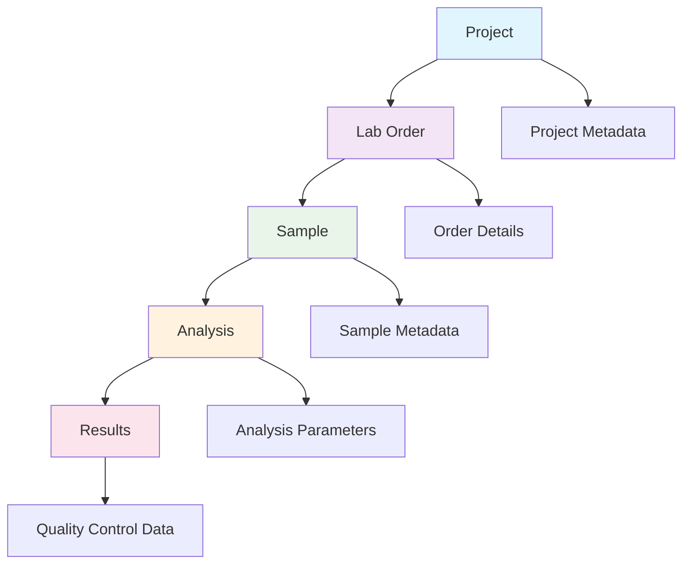

## Entity Relationships

### 1. Project Level
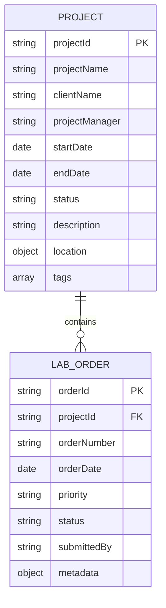

### 2. Lab Order to Sample Relationship
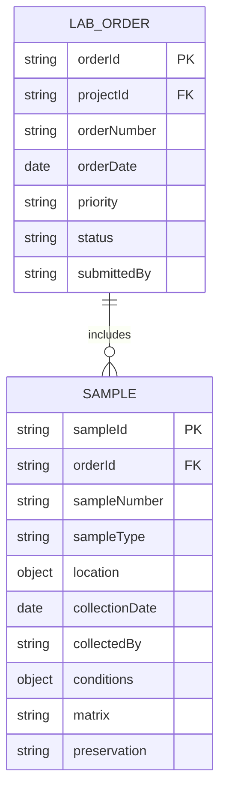

### 3. Sample to Analysis Relationship
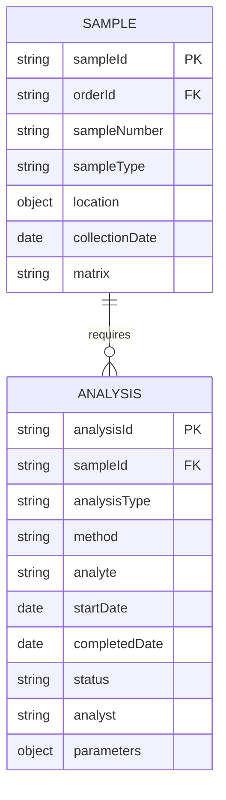

### 4. Complete Data Flow
```mermaid
flowchart LR
    A[Client Request] --> B[Create Project]
    B --> C[Generate Lab Order]
    C --> D[Sample Collection]
    D --> E[Sample Registration]
    E --> F[Analysis Assignment]
    F --> G[Laboratory Testing]
    G --> H[Quality Control]
    H --> I[Results Review]
    I --> J[Data Validation]
    J --> K[Report Generation]
    K --> L[Client Delivery]
    
    style A fill:#ffcdd2
    style L fill:#c8e6c9
```

## Firestore Collection Structure

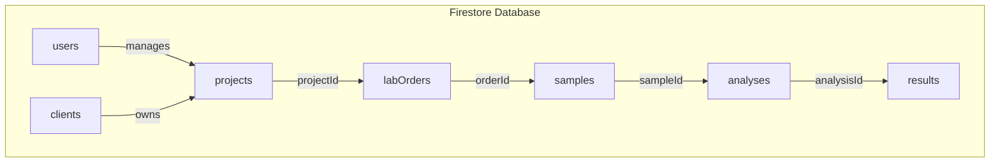

## Analysis Types and Parameters

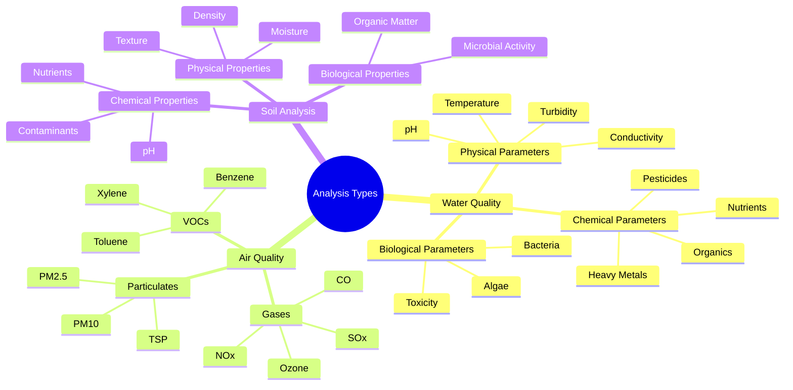

## Status Workflow

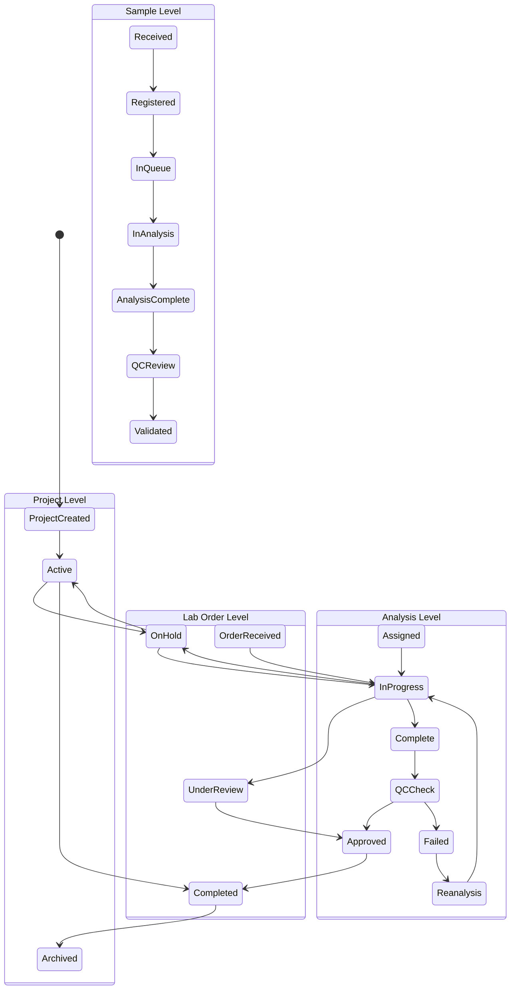

## Data Access Patterns

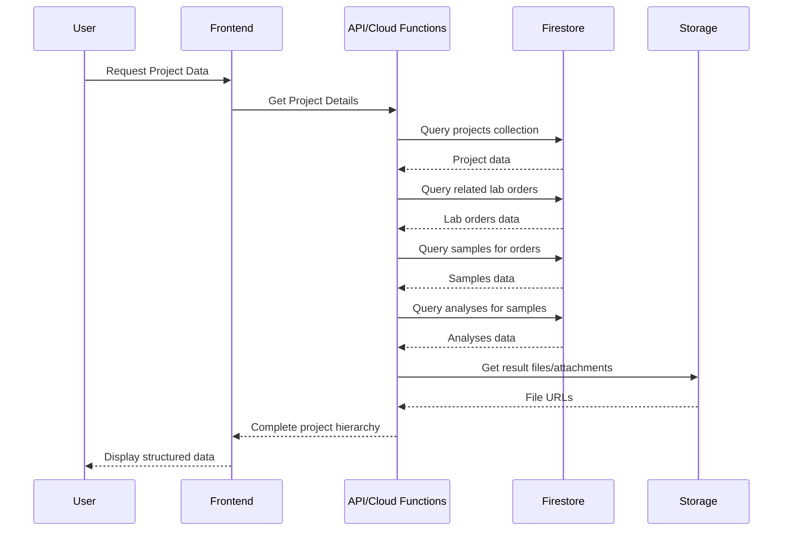

## Quality Control Integration

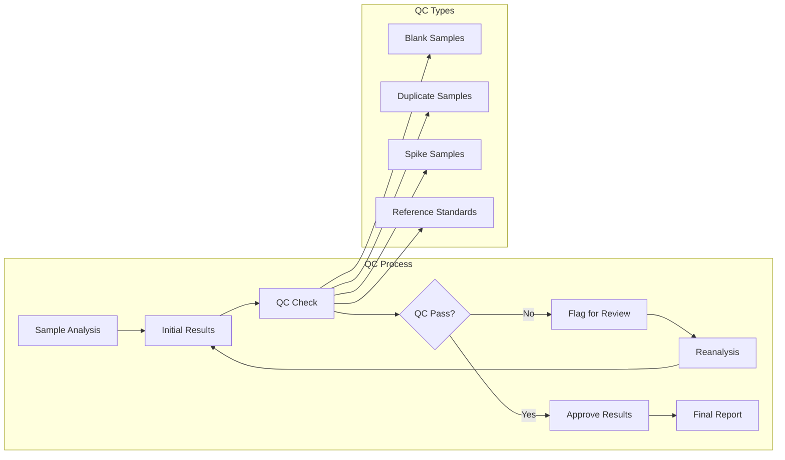

## Reporting Structure

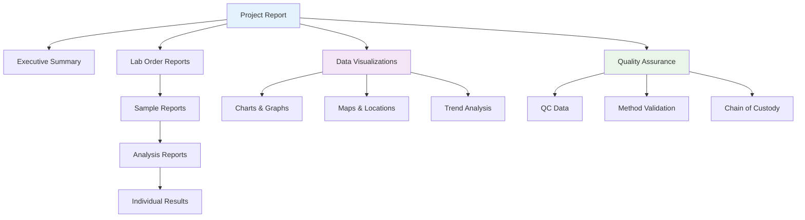

This documentation provides a comprehensive overview of the data structure and relationships in EcoData Hub, serving as a reference for developers, users, and stakeholders understanding the system architecture.