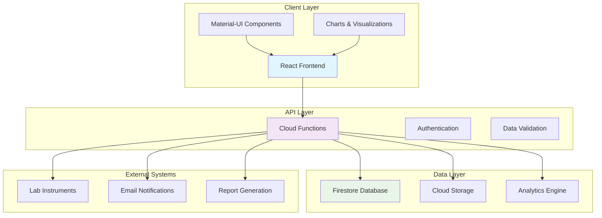
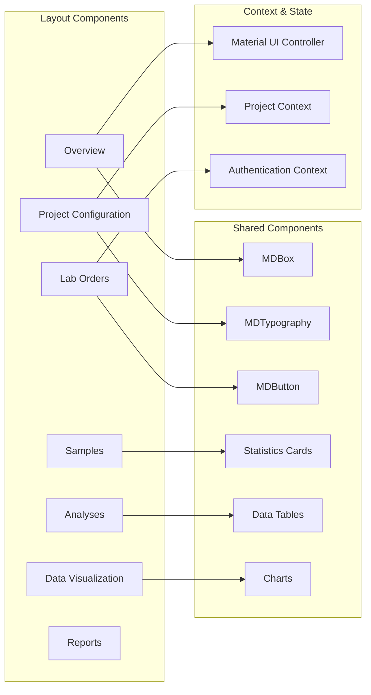
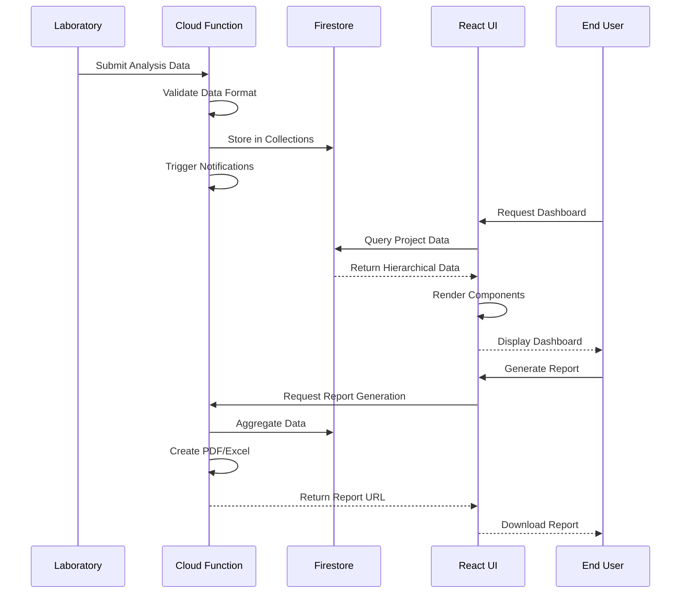
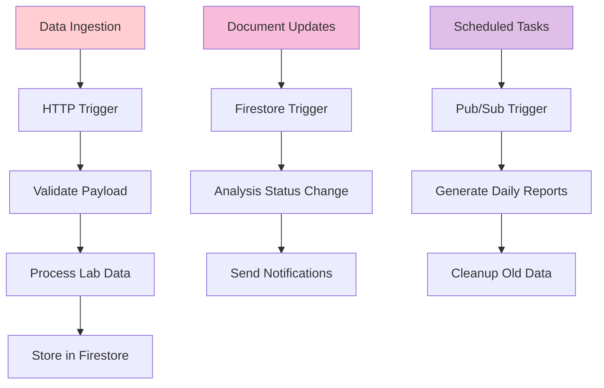
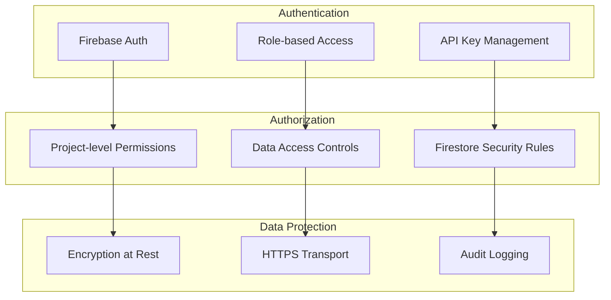
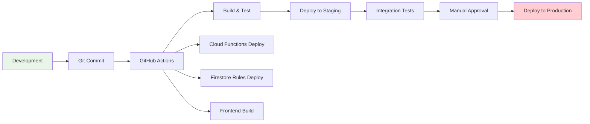
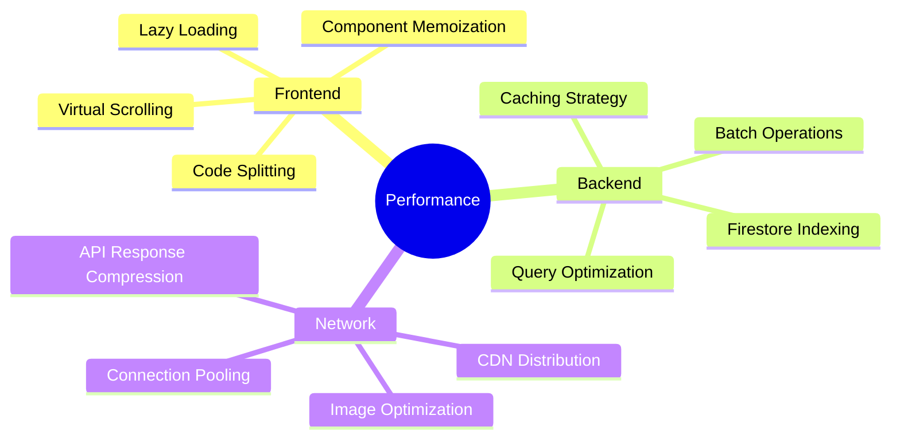
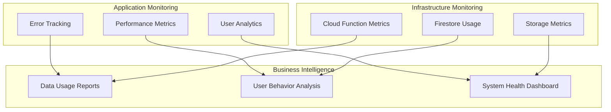
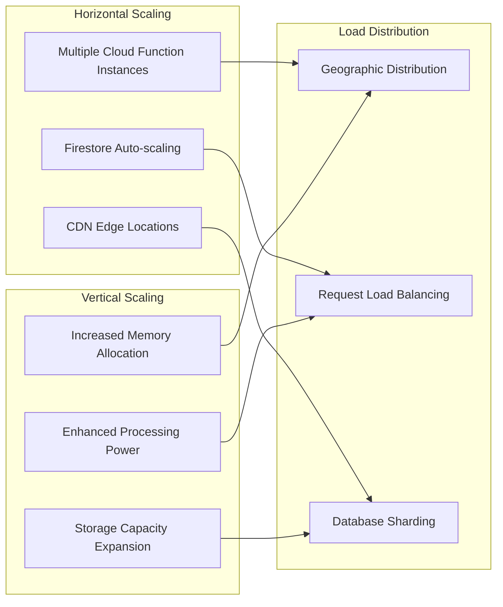
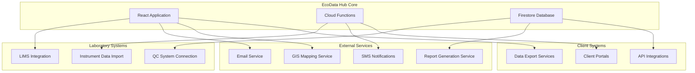

# EcoData Hub - Technical Architecture

## System Overview

EcoData Hub is built using React with Material-UI components, integrated with Google Cloud Firestore for data persistence and Cloud Functions for serverless backend processing.

## Architecture Diagram

## Component Architecture

## Data Flow Architecture

## Cloud Function Triggers

## Security Model

## Deployment Pipeline

## Performance Optimization

## Monitoring & Analytics

## Scalability Considerations

## Integration Points

This technical architecture documentation provides a comprehensive view of how EcoData Hub is structured, deployed, and integrated with various systems and services.