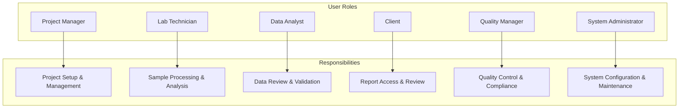
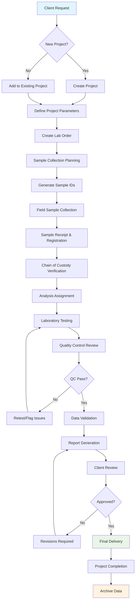
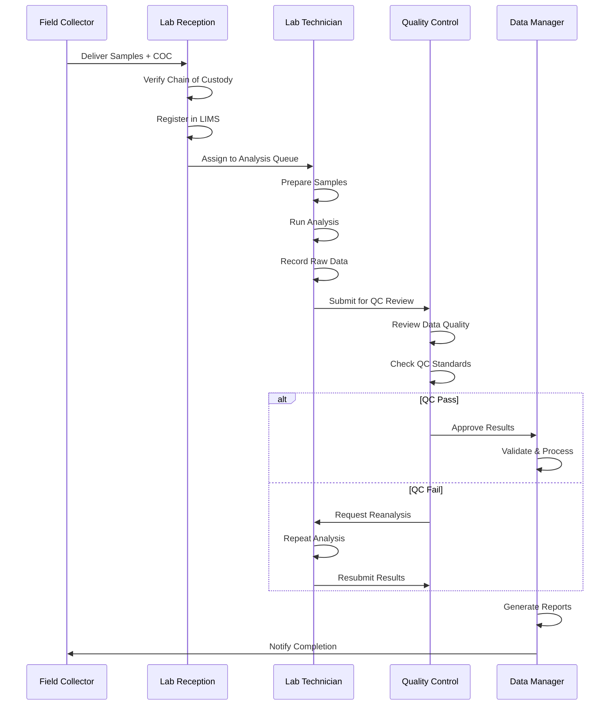
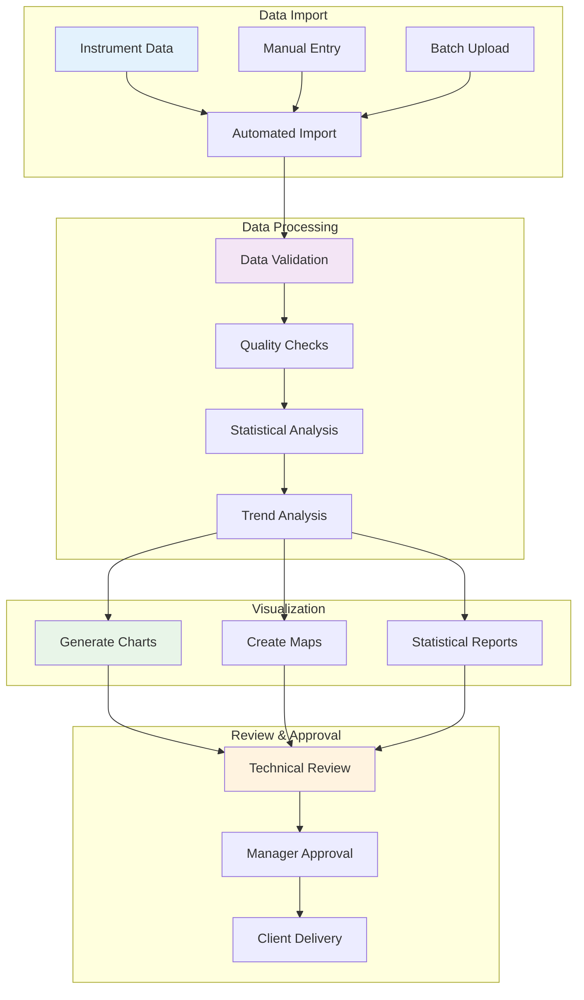
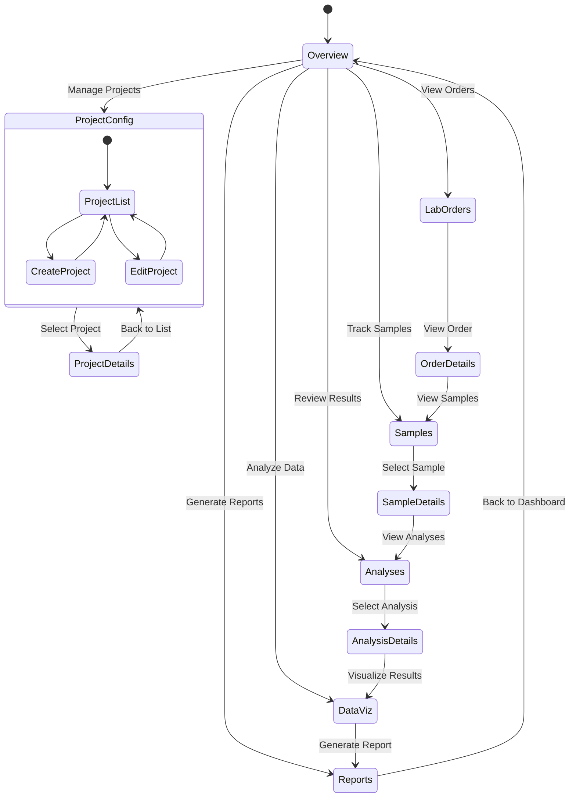
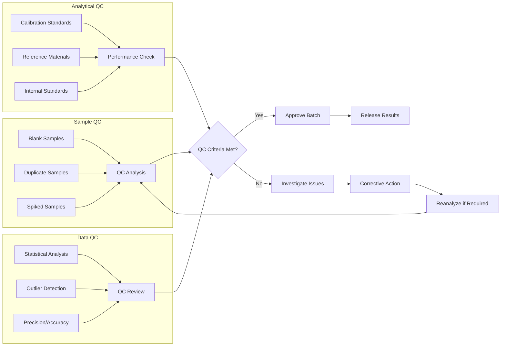
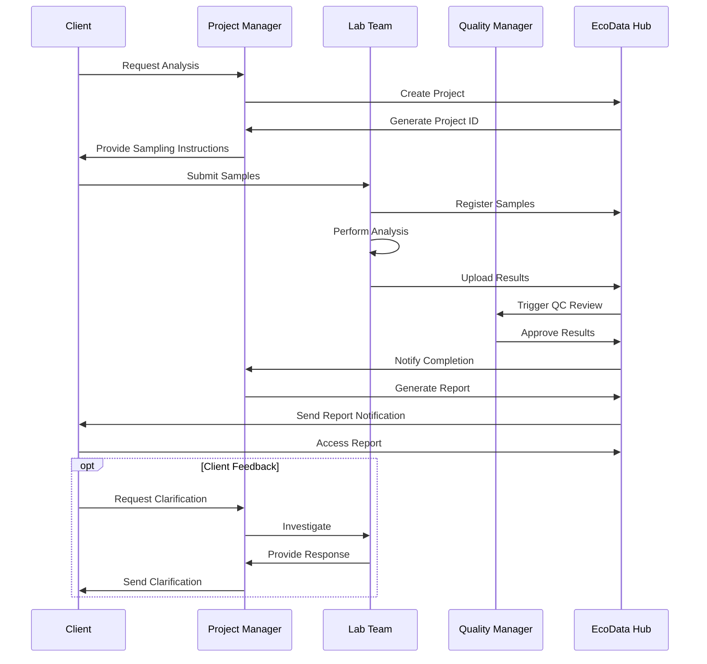
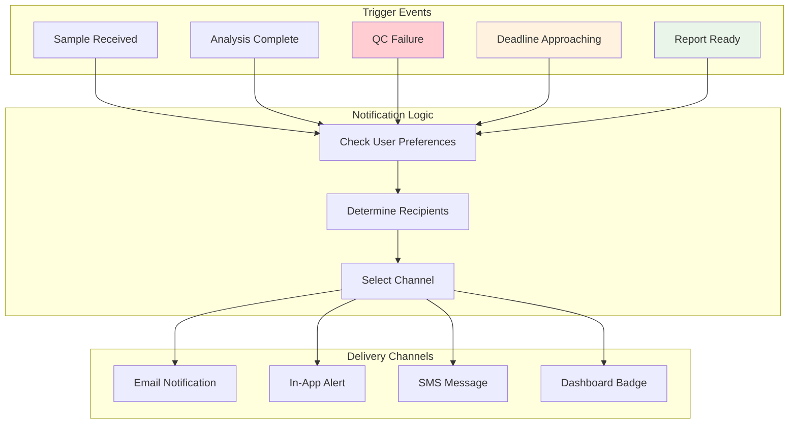
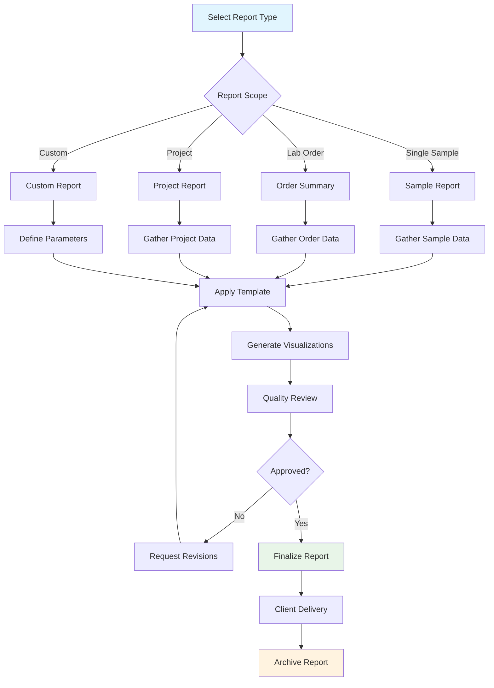
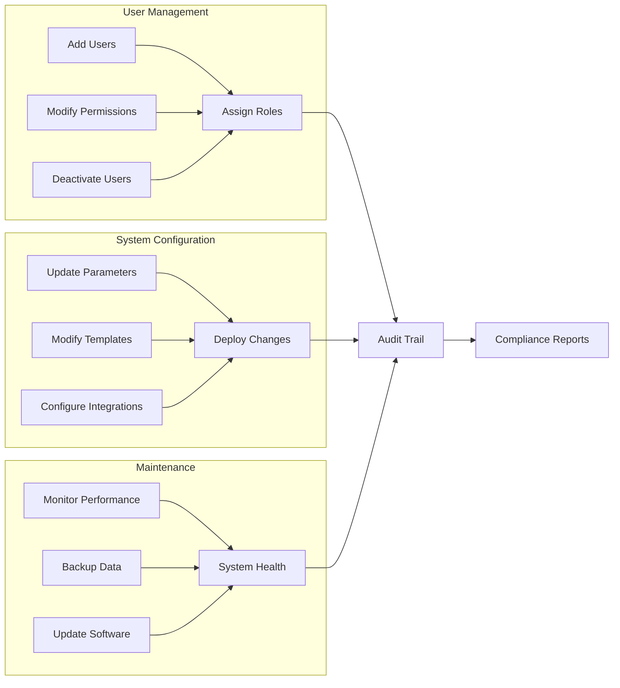

# EcoData Hub - User Workflows

## Overview

This document outlines the primary user workflows in EcoData Hub, from project creation through data analysis and reporting.

## Primary User Roles

## Project Lifecycle Workflow

## Sample Processing Workflow

## Data Analysis Workflow

## User Dashboard Navigation

## Quality Control Workflow

## Client Interaction Workflow

## Alert and Notification Workflow

## Report Generation Workflow

## System Administration Workflow

This workflow documentation provides a comprehensive view of how different users interact with EcoData Hub throughout the entire process lifecycle, from project initiation to final reporting and archival.